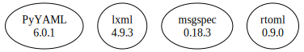

# Third Party Dependencies

<!--[[[fill sbom_sha256()]]]-->
The [SBOM in CycloneDX v1.4 JSON format](https://git.sr.ht/~sthagen/persoonallisuus/blob/default/sbom/cdx.json) with SHA256 checksum ([0beb880e ...](https://git.sr.ht/~sthagen/persoonallisuus/blob/default/sbom/cdx.json.sha256 "sha256:0beb880e0d4c6303e6e098c556d1d50ddf807432246e7ba7a1808f960cf63632")).
<!--[[[end]]] (checksum: e0dfaa3ce66b8fd4effe25d029a8c696)-->
## Licenses 

JSON files with complete license info of: [direct dependencies](direct-dependency-licenses.json) | [all dependencies](all-dependency-licenses.json)

### Direct Dependencies

<!--[[[fill direct_dependencies_table()]]]-->
| Name                                           | Version                                            | License     | Author                           | Description (from packaging data)                                                                        |
|:-----------------------------------------------|:---------------------------------------------------|:------------|:---------------------------------|:---------------------------------------------------------------------------------------------------------|
| [PyYAML](https://pyyaml.org/)                  | [6.0](https://pypi.org/project/PyYAML/6.0/)        | MIT License | Kirill Simonov                   | YAML parser and emitter for Python                                                                       |
| [lxml](https://lxml.de/)                       | [4.9.2](https://pypi.org/project/lxml/4.9.2/)      | BSD License | lxml dev team                    | Powerful and Pythonic XML processing library combining libxml2/libxslt with the ElementTree API.         |
| [msgspec](https://jcristharif.com/msgspec/)    | [0.16.0](https://pypi.org/project/msgspec/0.16.0/) | BSD License | Jim Crist-Harif                  | A fast serialization and validation library, with builtin support for JSON, MessagePack, YAML, and TOML. |
| [rtoml](https://github.com/samuelcolvin/rtoml) | [0.9.0](https://pypi.org/project/rtoml/0.9.0/)     | MIT License | Samuel Colvin <s@muelcolvin.com> | A better TOML library for python implemented in rust.                                                    |
<!--[[[end]]] (checksum: a5615a539eb901b1c7e3cdfa7edfa529)-->

### Indirect Dependencies

<!--[[[fill indirect_dependencies_table()]]]-->
| Name | Version | License | Author | Description (from packaging data) |
|:-----|:--------|:--------|:-------|:----------------------------------|
<!--[[[end]]] (checksum: 8a87b89207db0be2864af66f9266660c)-->

## Dependency Tree(s)

JSON file with the complete package dependency tree info of: [the full dependency tree](package-dependency-tree.json)

### Rendered SVG

Base graphviz file in dot format: [Trees of the direct dependencies](package-dependency-tree.dot.txt)



### Console Representation

<!--[[[fill dependency_tree_console_text()]]]-->
````console
lxml==4.9.2
msgspec==0.16.0
PyYAML==6.0
rtoml==0.9.0
````
<!--[[[end]]] (checksum: a5f8e2b5cc0fa8877894e8b848f90fe8)-->
