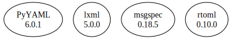

# Third Party Dependencies

<!--[[[fill sbom_sha256()]]]-->
The [SBOM in CycloneDX v1.4 JSON format](https://git.sr.ht/~sthagen/persoonallisuus/blob/default/sbom.json) with SHA256 checksum ([6e678300 ...](https://git.sr.ht/~sthagen/persoonallisuus/blob/default/sbom.json.sha256 "sha256:6e6783007c6c38fd97507bd59d8b2abced202a30fefbfabc6d27c0acf9521bc5")).
<!--[[[end]]] (checksum: ec22bde0923457454025a62de19f2e97)-->
## Licenses 

JSON files with complete license info of: [direct dependencies](direct-dependency-licenses.json) | [all dependencies](all-dependency-licenses.json)

### Direct Dependencies

<!--[[[fill direct_dependencies_table()]]]-->
| Name                                                               | Version                                            | License     | Author                           | Description (from packaging data)                                                                |
|:-------------------------------------------------------------------|:---------------------------------------------------|:------------|:---------------------------------|:-------------------------------------------------------------------------------------------------|
| [PyYAML](https://pyyaml.org/)                                      | [6.0](https://pypi.org/project/PyYAML/6.0/)        | MIT License | Kirill Simonov                   | YAML parser and emitter for Python                                                               |
| [lxml](https://lxml.de/)                                           | [4.9.2](https://pypi.org/project/lxml/4.9.2/)      | BSD License | lxml dev team                    | Powerful and Pythonic XML processing library combining libxml2/libxslt with the ElementTree API. |
| [msgspec](https://jcristharif.com/msgspec/)                        | [0.11.0](https://pypi.org/project/msgspec/0.11.0/) | BSD License | Jim Crist-Harif                  | A fast and friendly JSON/MessagePack library, with optional schema validation                    |
| [rtoml](https://github.com/samuelcolvin/rtoml/blob/main/README.md) | [0.9.0](https://pypi.org/project/rtoml/0.9.0/)     | MIT License | Samuel Colvin <s@muelcolvin.com> | A better TOML library for python implemented in rust.                                            |
<!--[[[end]]] (checksum: f67bfcfbbd1c8970f8792874bb1677be)-->

### Indirect Dependencies

<!--[[[fill indirect_dependencies_table()]]]-->
| Name | Version | License | Author | Description (from packaging data) |
|:-----|:--------|:--------|:-------|:----------------------------------|
<!--[[[end]]] (checksum: 8a87b89207db0be2864af66f9266660c)-->

## Dependency Tree(s)

JSON file with the complete package dependency tree info of: [the full dependency tree](package-dependency-tree.json)

### Rendered SVG

Base graphviz file in dot format: [Trees of the direct dependencies](package-dependency-tree.dot.txt)



### Console Representation

<!--[[[fill dependency_tree_console_text()]]]-->
````console
lxml==4.9.2
msgspec==0.11.0
PyYAML==6.0
rtoml==0.9.0
````
<!--[[[end]]] (checksum: 76235c9996d6027ee4575cad1dbc3e42)-->
